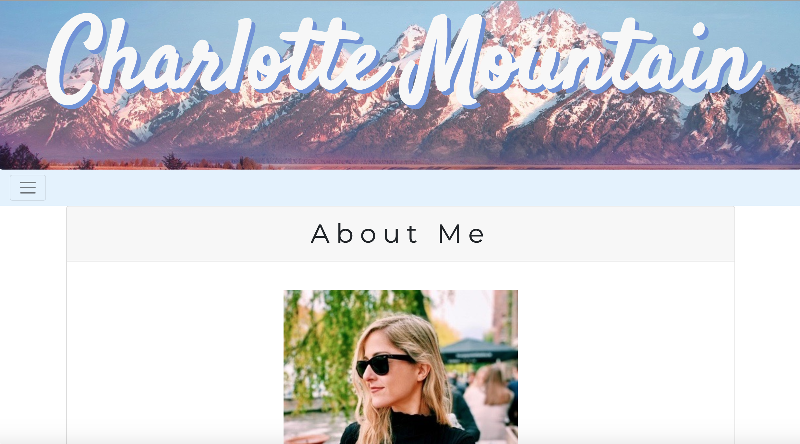
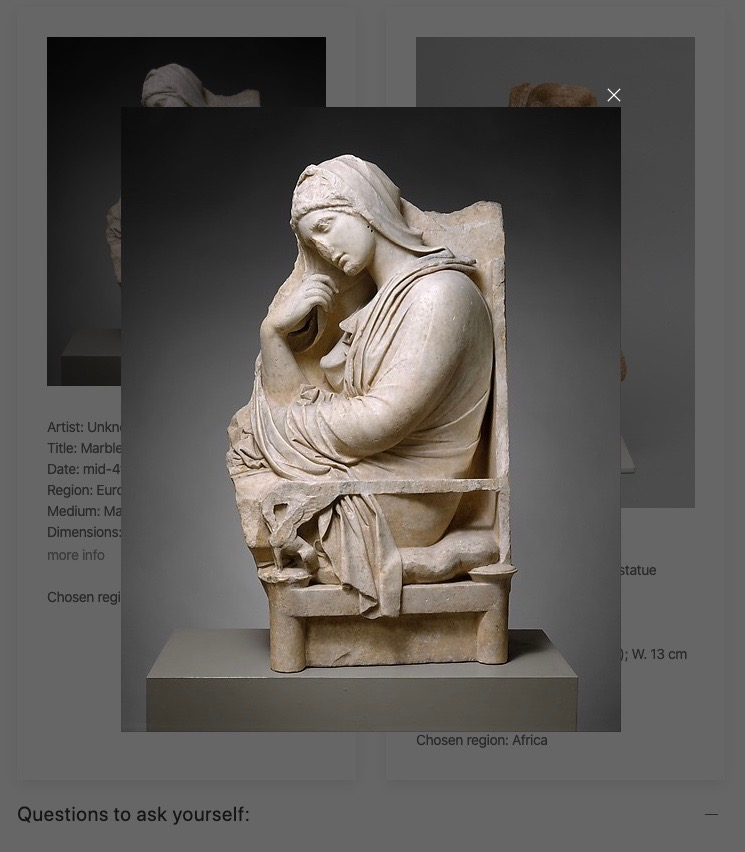
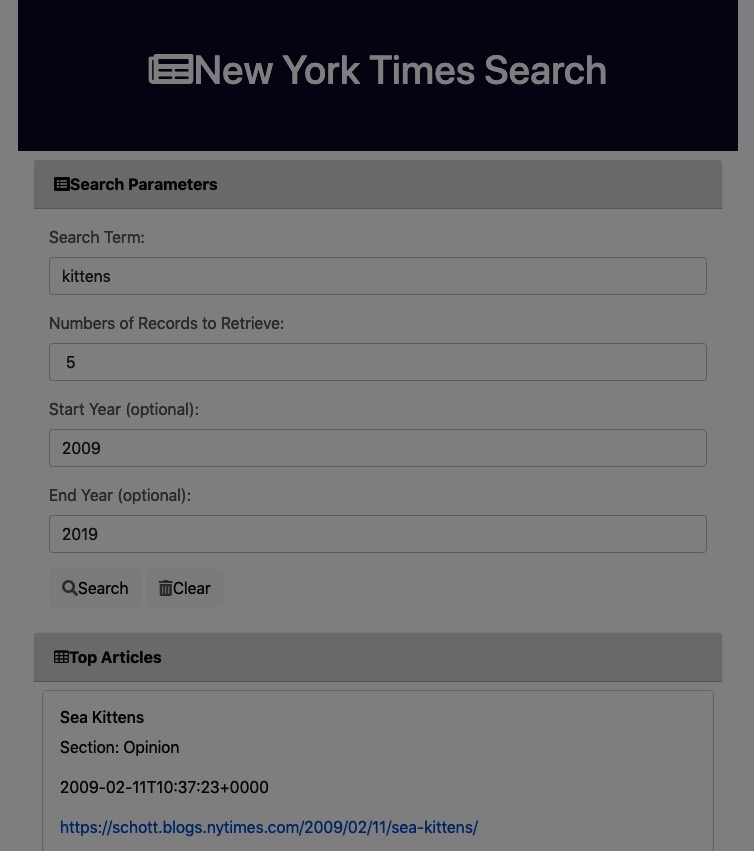
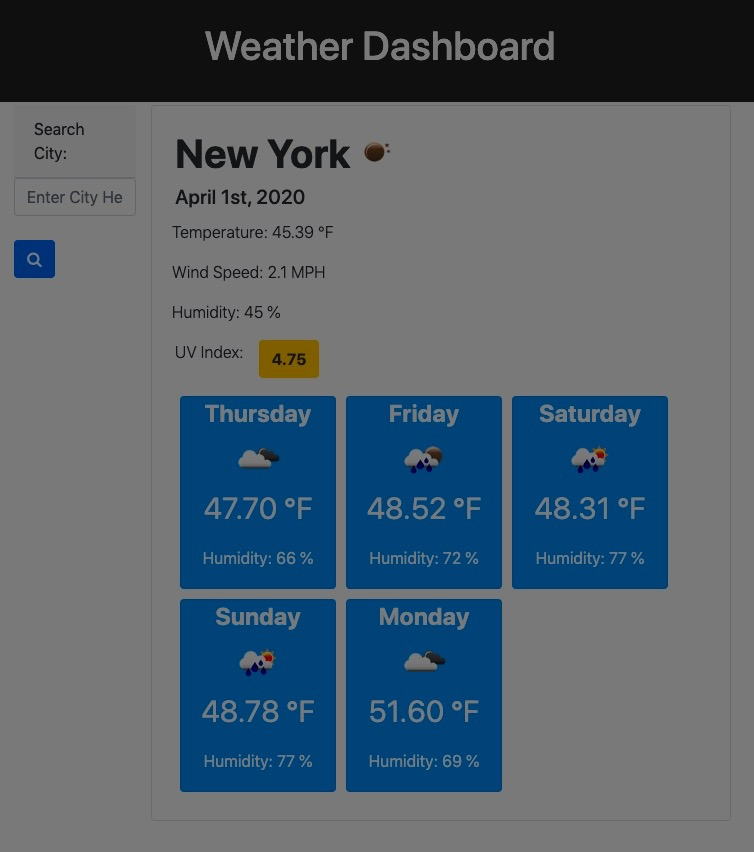

#  **Charlotte Mountain GitHub Portfolio** #

[Deployed Link](https://charrmountain.github.io)

## **Description**

-  Portfolio bio page on myself, Charlotte. 
    - ### **HTML pages:**
         1. [index.html](index.html) is the "About Me" page
         2. [portfolio.html](portfolio.html) is the "Portfolio" page which includes projects completed
         3. [contact.html](contact.html) is the "Contacts" page where there are links to all social media and email accounts.

    - ### **Style Sheets** (used on all HTML pages)**:**
         1. [JS/CSS Bootstrap](https://getbootstrap.com/docs/4.4/getting-started/introduction/)
         2. [GoogleFonts](https://fonts.google.com/)
         3. [style.css](style.css) (created by Charlotte)

    - ### **Image Files** 
     

     
       - picture of myself for the "About Me" 
      
     
       - picture for the background of the jumbotron.

     
       - picture from A Day Out project

     
       - picture from New York Times Search project

     
       - picture for the weather dashboard project

     - PDF of Resume attached at (images/resume20.pdf)
      

## **Visuals**
- There also a pseudo class of `:hover` when you scroll over the links in the can be noted in the [style.css](style.css) sheet.
- Media changes for phone capability located in [style.css](style.css) file.

## **Usage**
- Used components from some host websites such as  [JS/CSS Bootstrap](https://getbootstrap.com/docs/4.4/getting-started/introduction/) and [GoogleFonts](https://fonts.google.com/)

## **Support**
- e-mail: charr.mt@gmail.com
- [GitHub](https://github.com/charrmountain/charrmountain.github.io)
